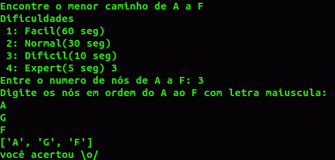
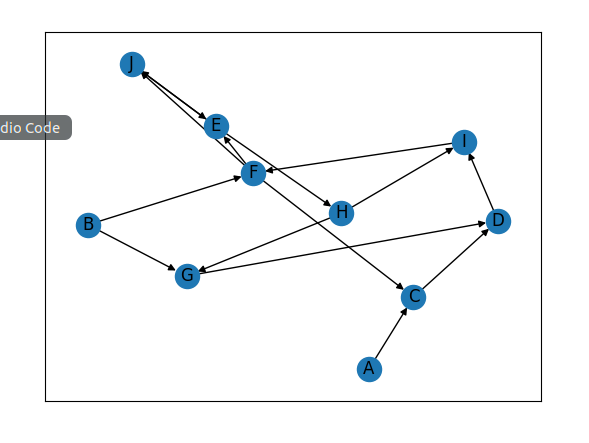
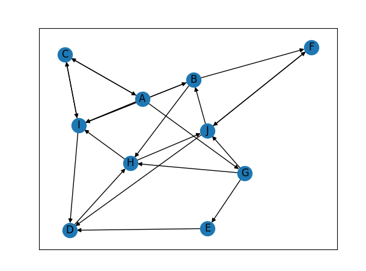

# PathFinder

**Número da Lista**: 1 
**Conteúdo da Disciplina**: Grafos 

## Alunos
|Matrícula | Aluno |
| -- | -- |
| 16/0124778  |  Ian Pereira de Sousa Rocha |
| 16/0112028  |  André Goretti Motta|

## Link para vídeo explicativo:
> https://youtu.be/uYP5vSq8xps

## Sobre 
PathFinder é um jogo que desafia o usuário a tentar adivinhar o caminho mais rápido entre 2 nós (A e F), no qual vc pode selecionar a dificuldade para ter mais tempo ou não para visualizar o grafo montado aleatoriamente pelo programa 

## Screenshots

## Instalação 
**Linguagem**: Python 

#### Para rodar na sua máquina vc precisa desses requisitos:
#### NetworkX:
  >  $ pip install networkx[all]

#### MatplotLib
> python -m pip install -U pip
 > python -m pip install -U matplotlib

## Uso 
 Assim que executar o programa, ele irá lhe perguntar qual a dificuldade que você prefere, responda somente com números de 1 a 4 correspondente a dificuldade escolhida, após isso, visualize o grafo gerado aleatoriamente, espere o tempo de acordo com a dificuldade ou feche a imagem. O programa irá lhe pedir o número de nós entre A e F (contando eles), após sua resposta, ele irá lhe pedir pra digitar todos os nós correspondentes e falar se vc acertou ou não.
